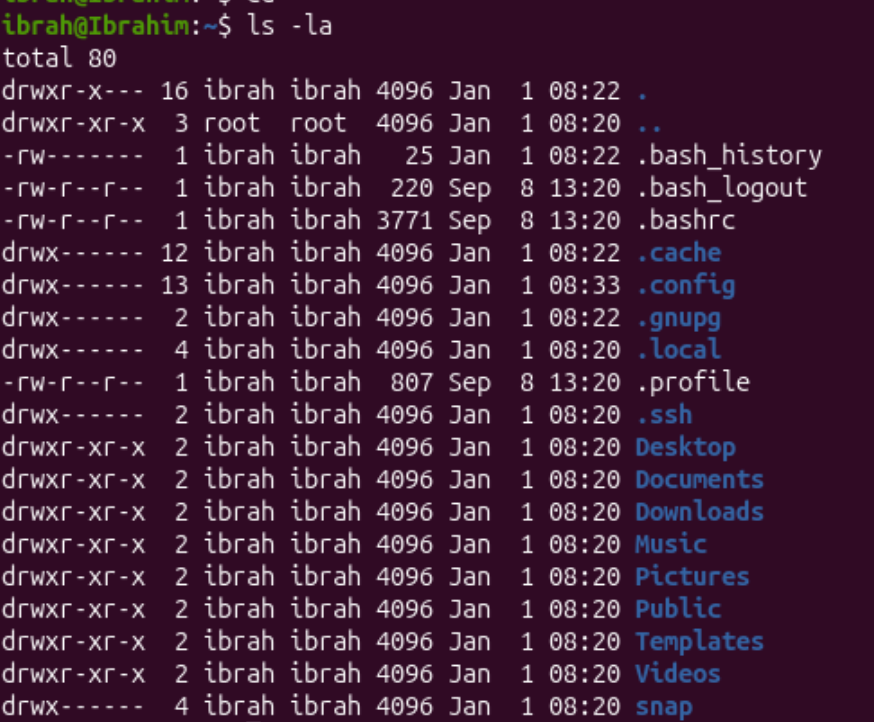
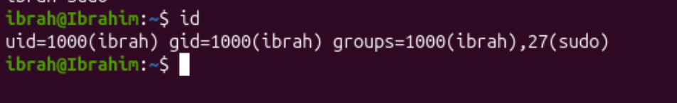
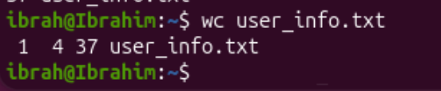
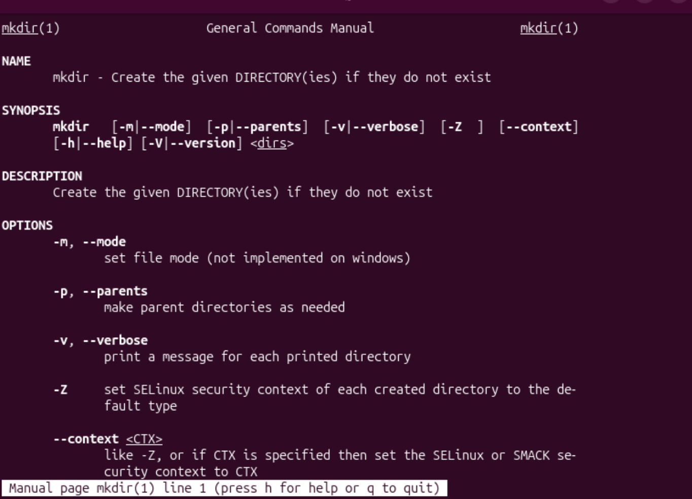
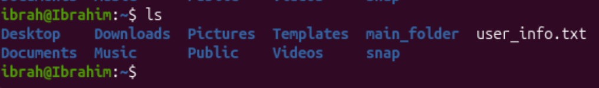
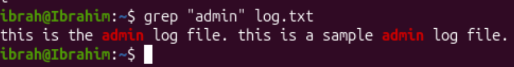
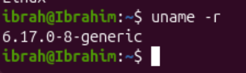

# Question 1

1. 
command: 
```bash
id
```


The first user dislayed is the current user id followed by the username, in this case, 1000 and ibrah is the uid and name for the current user respectively.

Users displayed after groups= are the groups that the current user account belongs to

2. 
command:
```bash
ls -la
```

The ```ls``` command is used to display all files and directories in the orking directory. The -la option lists these details for each and displays the hidden files and folders as well.

3. 
command:
```bash
echo '"Linux user environment verified"' >> user_info.txt
```

echo command writes the specified text inside the single quotes to the file user_info.txt

4. 
command:
```bash
wc user_info.txt
```

The output says:
this file has 1 line of content, 4 words and 37 characters

5. 
command:
```bash
man mkdir
```

Useful option: -p
```bash
mkdir -p main_folder/sub_folder/sub_folder1
```

Creates the directories (main_folder, sub_fodler and sub_folder1), each nested inside of its former directory
Adding this option won't throw an error if the directory already exists

6. 

The ```ls``` command itself displays contents of working directory in an alphabatical order

7. 
First, we create log.txt and add some sample text in it
```bash
echo "this is the admin file. this is a sample admin log file." >> log.txt
```
Search in log.txt
```bash
grep "admin" log.txt
```

the searched word is higlighted in red in the output

8. 
```bash
uname -r
```

6.17.0