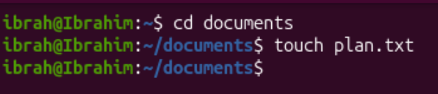
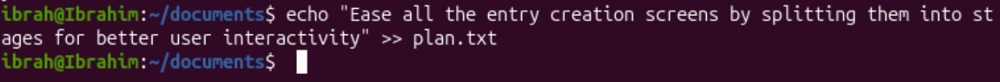
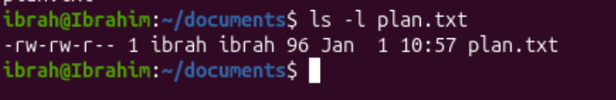
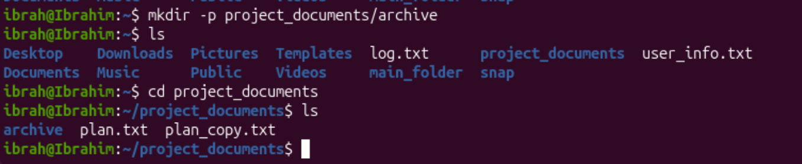
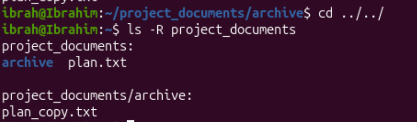
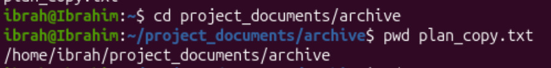

# Question 2

1. 

Create a directory called documents

2. 
```bash
# to navigate to documents folder
cd documents
```
```bash
# to create a file named plan.txt
touch plan.txt
```



3. 
command:
```bash
echo "Ease all entry creation screens by splitting them into stages for better use interactivity" >> plan.txt
```

echo inserts the line of text inside the double into plan.txt file

4. 
command:
```bash
ls -l plan.txt
```

```ls``` command: specifying the option ```-l``` and the file name outputs the file's permissions

`-` indicates it's a regular file

`rw-`: owner has read and write permissions

`rw-`: group has read and write permissions

`r--`: others ave read only permissions

`1`: this indicates the number of hard links to the file

then the next two columns display the owner username and group name for the file, respectively

`96`: 96 bytes of data

`Jan 1 10:57`: Last modification date time

5. 
```bash
cp plan.txt plan_copy.txt
```

Creates a copy of the file plan.txt with the name plan_copy

6. 
```bash
mv documents project_documents
```

we can use the mv command to rename a folder to the specified

7.
```bash
mkdir -p project_documents/archive
# we can verify this by moving to the project_documents directory and running the ls command
cd project_documents
ls
``` 


8. 
```bash
mv plan_copy.txt archive/
```

we can verify to see the file has moved by running the `ls` command

9. 
```b
ls -R directories
```


project_documents contents are:
archive (folder) and plan.txt (file)

sub folder archive's contents are:
plain_copy.txt

10. 
```bash
# move to the archive folder and
pwd plan_copy.txt
```


/home/ibrah/project_documents/archive/plan_copy.txt is the absolute path of the plan_copy.txt file