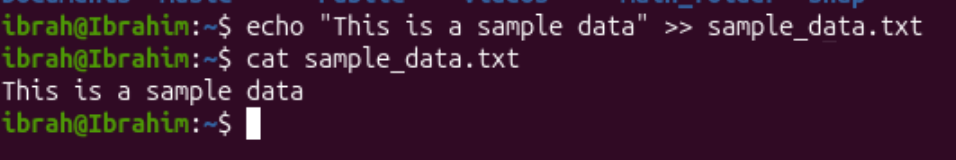
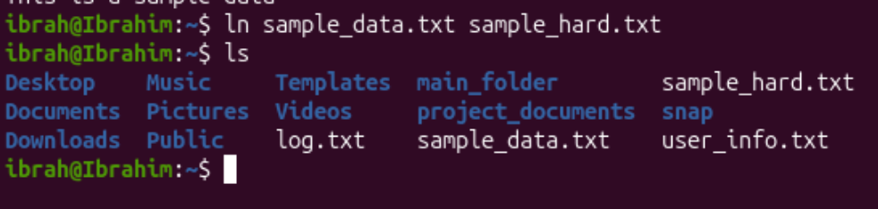
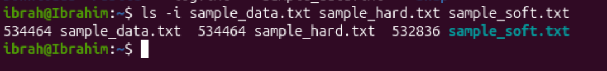

# Question 3

1. 
command:
```bash
# Create file named sample_data.txt and write the specified line into it
echo "This is a sample data" >> sample_data.txt
# To check the contents of sample_data.txt
cat sample_data.txt
```


2. 
command:
```bash
ln sample_data.txt sample_hard.txt
```

Created the hardlink for for sample_data.txt named sample_hard.txt

3. 
command:
```bash
ln -s sample_data.txt sample_soft.txt
``` 

Creating symbolic links are done in the same way as hard links except we add the option `-s` to let the command line know we're actually creating a symbolic link

4. 
command:
```bash
ls -i sample_data.txt sample_hard.txt sample_soft.txt
```

534464 is the inode number of sample_data.txt

sample_hard.txt has the inode number of the original file as it's a hard link

532836 is the inode number of sample_data.txt

5. 
