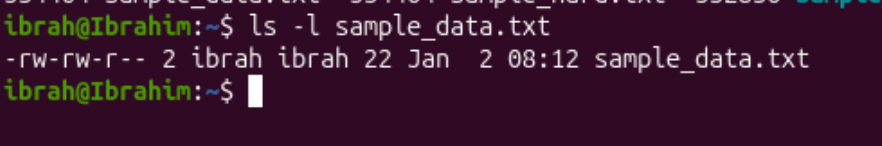
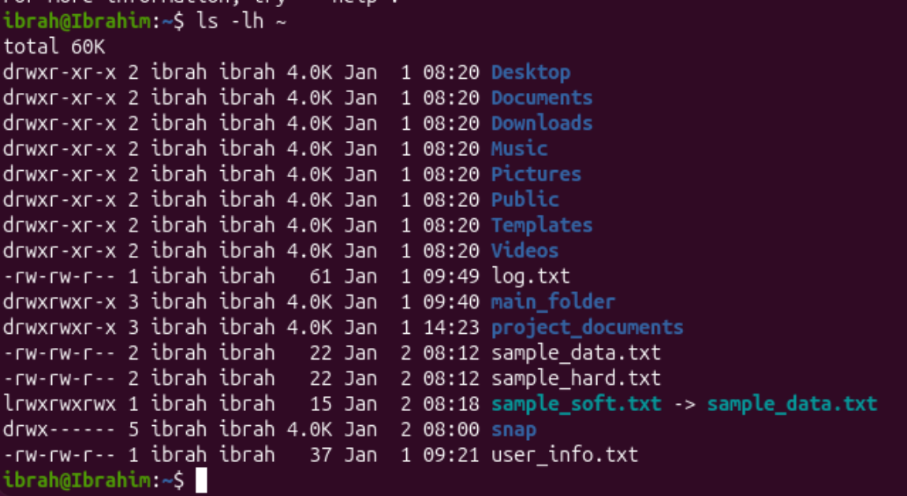
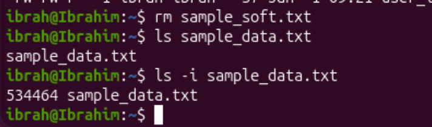
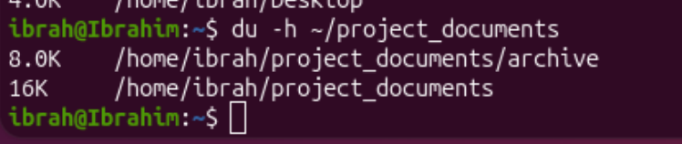
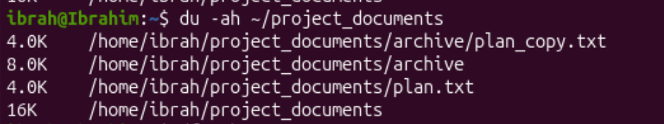
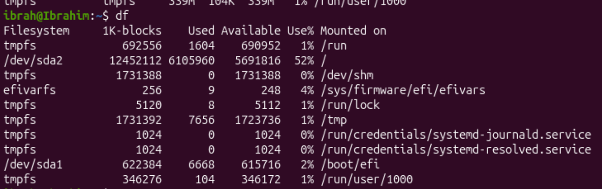
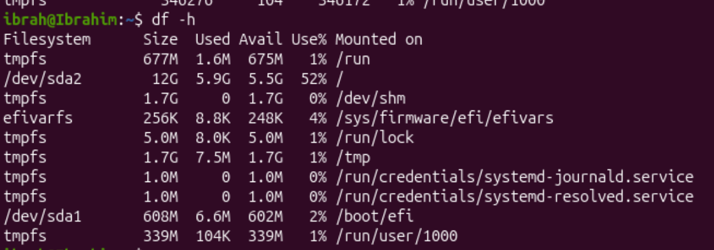

# Question 3

1. 
command:
```bash
# Create file named sample_data.txt and write the specified line into it
echo "This is a sample data" >> sample_data.txt
# To check the contents of sample_data.txt
cat sample_data.txt
```


2. 
command:
```bash
ln sample_data.txt sample_hard.txt
```

Created the hardlink for for sample_data.txt named sample_hard.txt

3. 
command:
```bash
ln -s sample_data.txt sample_soft.txt
``` 

Creating symbolic links are done in the same way as hard links except we add the option `-s` to let the command line know we're actually creating a symbolic link

4. 
command:
```bash
ls -i sample_data.txt sample_hard.txt sample_soft.txt
```

534464, 534464 and 532836 is the inode number of sample_data.txt, sample_hard.txt and sample_soft.txt respectively

5. 
sample_data.txt and sample_hard.txt share the same inode number becuase latter is the hard link of the former and hard links' inode number never differs from its original file

6. 
```bash
ls -l sample_data.txt
``` 


Permissions:<br>
owner and groups have read and write permissions while others have read only permissions.

ibrah is the owner and the group name is ibrah as well

The size of the file is 22 bytes

The file was last modified at 2nd Jan, 8:12

7. 
command:
```bash
du -sh ~
```

174MB has is used by the home directory.

8.
command:
```bash
ls -lh ~
``` 

The output displays the ach file and folder from the home directory. The ouput displays the file/folder permissions on the first column, followed by the owner username and group name. The 4th column displays the size and then the last modified datetime.

9. 
command:
```bash
rm sample_soft.txt
```

we can verify the original file is unnaffected by running the following command:<br>
```bash
ls -i sample_data.txt
```
output:
```
534464 sample_data.txt
```
We can see that the original file is unaffected

10. 
<b>du command</b><br>
command:
```bash
du -sh ~
```

Outputs the disk usage of the home directory - which in this case is 174MB
<br><br>
```bash
du -h ~/project_documents
```

outputs the size of each sub-directory
<br><br>
```bash
du -ah ~/project_documents
```

includes files in addition to folders and displays their corresponding sizes

<b>df command</b><br>
```bash
df
```

df command outputs how much space is used and free on mounted filesystems
<br><br>
```bash
df -h
```

outputs the same as `df` but in a human readable format
<br><br>
```bash
df -Th
```
ouputs the same as df -h with additional column 'Type' that displays the filesystem types

```bash
df -h ~
```

shows the disk usage for the filesystem containing the specified directory - in this case, the home directory