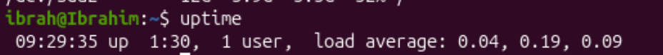
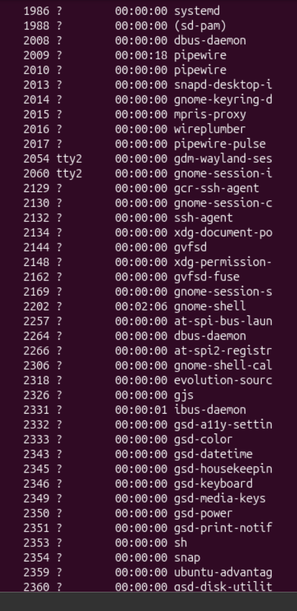
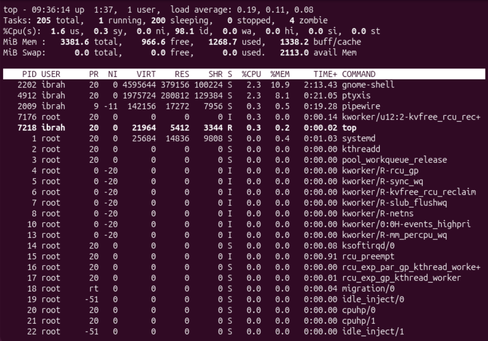
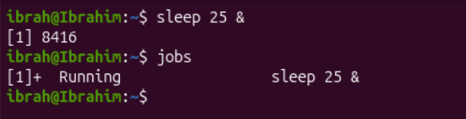
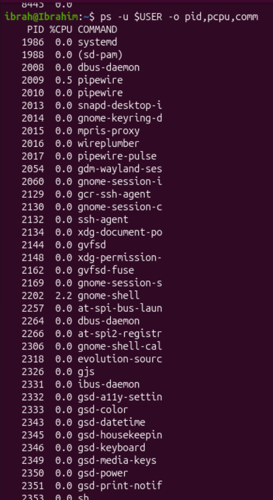

# Question 4

1.
```bash
uptime
``` 

The system has been up for 1 hour and 30 mins

2. 
```bash
ps -u $USER
```

All the processes running on he current user account

3. 
```bash
top
```

we can see that process with IDs 2202 and 4902 are consuming highest CPU usage with 2.3%

4.
we can run the sleep command
```bash
sleep 100 & 
``` 
this command sleeps (times out) for 25 seconds and then runs the command that comes after &

we can verify this job is running while it is by runnning:
```bash
jobs
```
output:
```
[1]+ Running        sleep 25 &
```

when it finishes running the `jobs` will ouput he following:
```
[1]+ Done        sleep 25 &
```

5.
```bash
pu -u $USER -o pid,pcpu,comm
``` 

the order of columns for the output is changes to Process ID, %CPU and Command name

6. 
